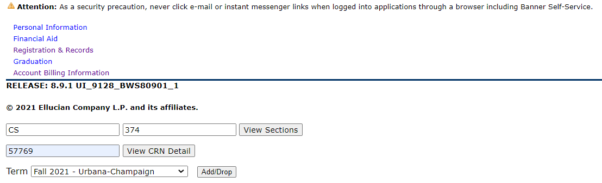
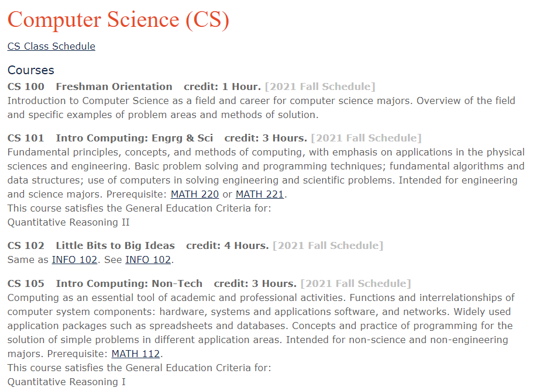
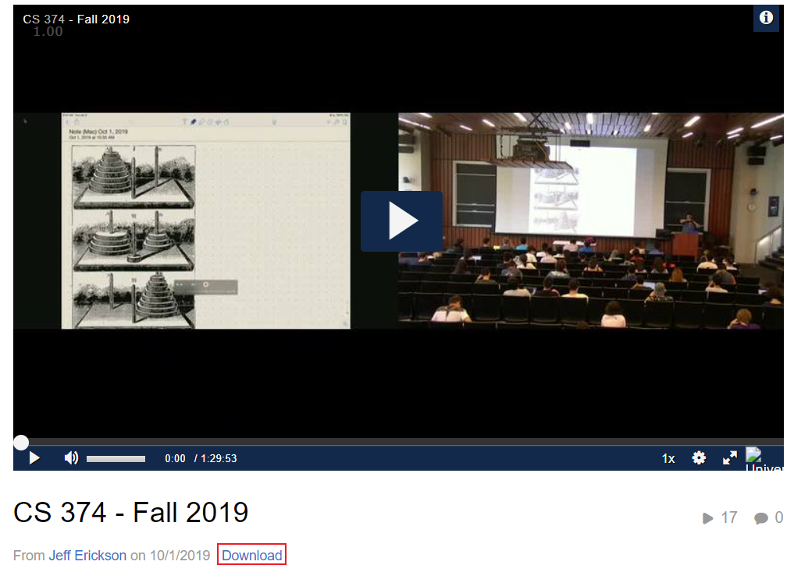

### Registration_helper_new

This script adds some input boxes and buttons at the bottom of Self-service. You can use it to:

* Quickly view the sections of a give course subject and number

* Quickly view the section detail with a given CRN
* Jump to the Add/Drop interface of a given term

### Schedule_link_helper

This script adds a `[2021 Fall Schedule]` link near the course title in Course Explorer. You can use it to skip selecting the term.

### Video_helper

This script adds a `Download` link under a mediaspace video.

